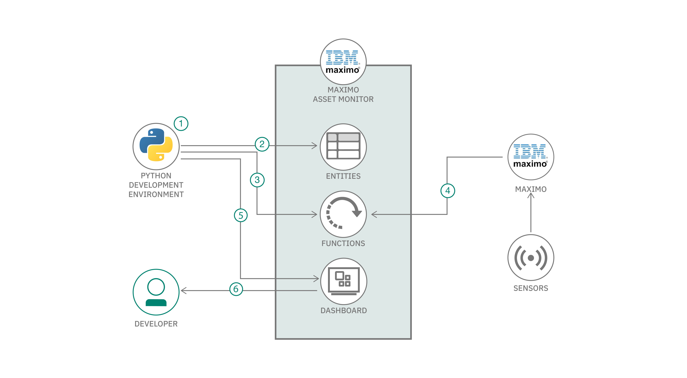
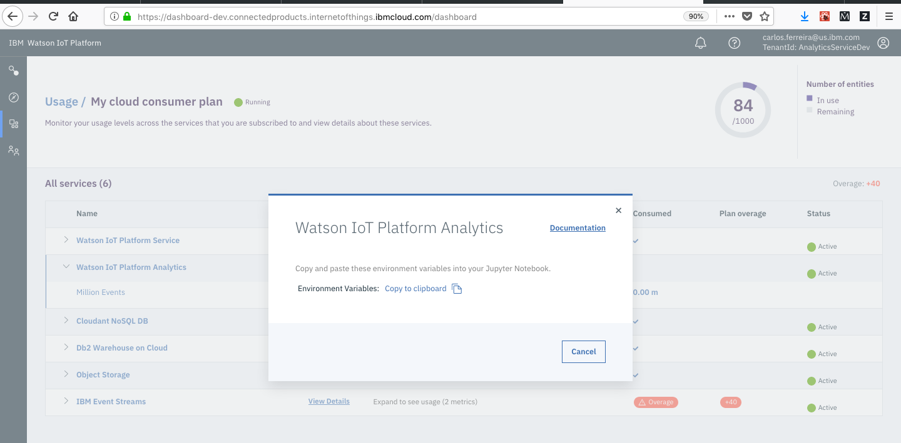
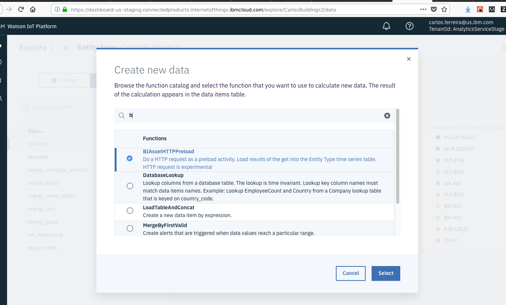
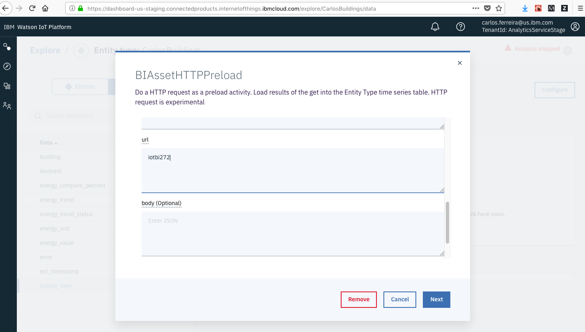
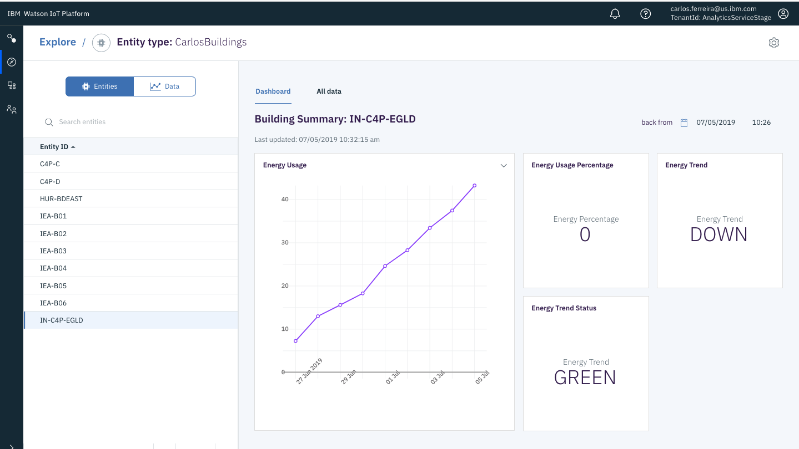

# Detect anomalies in data streamed to "Maximo Asset Monitor"

In this Code Pattern we will show how to publish data stored within an Watson IOT Platform Analytics instance to an external service. Once the data is analyzed by the service, the results can then be persisted in the Analytics Platform database.

Our specific demonstrated use case here is to detect anomalies within a Maximo Asset Monitor dataset using a scikit-learn model, which is externally hosted in a Watson Machine Learning service. We'll also demonstrate how to visualize correlations between anomalies via time-series graphs.

When the reader has completed this Code Pattern, they will understand how to:

* Load asset data into [Watson IOT Platform Analytics](https://www.ibm.com/support/knowledgecenter/en/SSQP8H/iot/analytics/as_overview.html).
* Forward data to external services via REST HTTP call.
* Build a dashboard using [Maximo Asset Monitor](https://www.ibm.com/support/knowledgecenter/SSQP8H/iot/monitor/index.html) to monitor, visualize, and analyze IOT asset data.
* Generate alerts when certain results are received.
<!-- * Deploy, schedule and run custom Python Functions in [Watson IOT Platform Analytics](https://www.ibm.com/support/knowledgecenter/en/SSQP8H/iot/analytics/as_overview.html) to retrieve data from Maximo every 5 minutes. -->

<!-- [IBM TRIRIGA Building Insights](https://www.ibm.com/support/knowledgecenter/en/SSQP8H/iot/analytics/as_overview.html) -->
<!-- * Define Assets in -->

The intended audience for this Code Pattern are developers / data scientists who would like to analyze their data in Watson IOT Platform Analytics via customized machine learning models that are hosted externally.

<!--  -->


# Flow

1. IoT data is retrieved by function in Watson IOT Platform Analytics
2. Data is packaged as a dataframe and forwarded to a REST endpoint where custom model is hosted
3. Model results are retrieved and appended to dataset
4. Dataset is validated and committed to DB, alert is sent if anomaly is detected

<!-- 4. Schedule the function to collect asset data -->
<!-- 5. Create a Monitoring Dashboard to manage the asset -->
<!-- 6. View the Monitoring Dashboard with Building Energy Consumption -->


#  Components

* [Watson IOT Platform Analytics](https://www.ibm.com/support/knowledgecenter/en/SSQP8H/iot/analytics/as_overview.html). This is a SaaS offering that allows you to register devices, collect IOT Data and build IOT applications. This add-on service extends "Watson IoT Platform" to include [Maximo Asset Monitor](https://www.ibm.com/support/knowledgecenter/en/SSQP8H/iot/dashboard/monitoring.html). Sign up for an account [here](https://www.ibm.com/us-en/marketplace/internet-of-things-cloud/purchase)

<!-- * [Maximo](https://www.ibm.com/products/maximo). An IBM SAAS offering that allows you to register and manage assets. Sign up for a free trial [here](https://www.ibm.com/account/reg/us-en/signup?formid=urx-20869)   -->

* [HTTPPreload](https://ibm.biz/BdzvyX) This is a prebuilt analytics function that allows you to collect IOT asset and sensor data from external data sources.

* [Watson Machine Learning](https://cloud.ibm.com/catalog/services/machine-learning) This is a service that enables developers to expose their machine learning models via a REST interface.

<!-- * [Monitoring Dashboard]() Code free dashboards that allow you to monitor a variety of types of assets.  Use out of the box cards to visualize timeseries data and other asset properties. -->


# Prerequisites

* An account on IBM Marketplace that has access to Watson IOT Platform Analytics and Maximo Asset Monitor. This service can be provisioned [here](https://www.ibm.com/us-en/marketplace/internet-of-things-cloud/purchase)

* Python 3, pip

# Steps

Follow these steps to setup and run this Code Pattern.
1. [Provision cloud services](#1-provision-cloud-services)
2. [Setup your Python development environment](#2-setup-your-python-development-environment)
3. [Leverage Python scripts to register entity, function, and ML model](#3-Leverage-python-scripts-to-register-entity-model-and-function)
4. [Deploy Function](#4-deploy-function)
5. [Add alerts](#5-add-alerts)
6. [Add Dashboard Visualizations](#6-add-dashboard-visualizations)
<!-- 5. [Create a Dashboard](#4-create-dashboard) -->


## 1. Provision Cloud Services

Navigate to the IBM Cloud dashboard at [https://cloud.ibm.com/](https://cloud.ibm.com/) and click the "Catalog" button in the upper right
<p align="center">

</p>

Search for the "Watson Machine Learning" service and select the resulting icon
<p align="center">
https://i.imgur.com/tk6umPY.png
</p>

Select the pricing plan and click "Create". If deploying on an IBM Lite account, be sure to select the free "Lite" plan
<p align="center">

</p>

Click on the "Service Credentials" section. Copy and paste the generated credentials, and place them into a file in the root directory of this project titled "wml_credentials.json".
<p align="center">

</p>

Navigate back to the IBM Cloud catalog [https://cloud.ibm.com/catalog](https://cloud.ibm.com/catalog)

Search for the "Watson Studio" service and select the resulting icon
<p align="center">

</p>

Select the pricing plan and click "Create". If deploying on an IBM Lite account, be sure to select the free "Lite" plan
<p align="center">

</p>

Once the service has been provisioned, select the "Get Started" button to enter the Watson studio console
<p align="center">

</p>

Once the Watson Studio dashboard has loaded, scroll to the "Projects" section and click "New Projects" to create a project.
<p align="center">

</p>

Select a "Empty Project" as the project type
<p align="center">

</p>

Enter a project name, and then click "Create"
<p align="center">

</p>

Once the project has been created, a dashboard showing all the project assets will be displayed.

Finally, we'll need to associate our "Watson Machine Learning" service with our project. We can do so by clicking "Settings"
<p align="center">

</p>

Then, scroll down to the Associated services section. Click "Add Service" -> "Watson".
<p align="center">

</p>

Click "Machine Learning"
<p align="center">

</p>

Find your instance on the drop-down list, and then click "Select"
<p align="center">

</p>


## 2. Setup your Python development environment

### Install Python

Clone this repository
```
git clone git@github.com:IBM/maximo-anomaly.git
cd maximo-anomaly
```

Instal virtualenv (if you don't have it already)
```
sudo pip install virtualenv
```

Create a virtual environment
```
python3 -m venv env
```
<!-- virtualenv -p python3 env -->

### Activate Virtual Environment, Install Python Dependencies and Verify Environment
Enter your Virtual Environment directory
```
cd env
```
Activate your virtual environment
```
source bin/activate
```

Copy the `url`, `instance_id` and `apikey` values from your `wml_credentials.json` file into a .env file. Save these values as "WATSON_ML_ENDPOINT", "WATSON_ML_INSTANCE_ID", and "WATSON_ML_APIKEY", respectively.

WATSON_ML_INSTANCE_ID="<instance_id>"
WATSON_ML_ENDPOINT="<url_value>"
WATSON_ML_APIKEY="<apikey_value>"


### Install dependencies
```
# Prereqs
pip install numpy
pip install sqlalchemy pandas ibm_db_sa urllib3 requests lxml sklearn ibm_db python-dotenv future

# Watson IOT Functions
pip install git+https://github.com/ibm-watson-iot/functions.git@production --upgrade
pip install -r requirements.txt

# Watson Machine Learning Client
pip install watson_machine_learning_client
```


<!-- * Apply fix for DYLD (OS X only)

```
# Navigate to your preferred python installation
cd /usr/local/lib/python3.7/site-packages

``` -->
<!--
* Install Watson IOT Functions dependencies:
```
pip install git+https://github.com/ibm-watson-iot/functions.git@production --upgrade
``` -->
<!-- * Set PYTHONPATH to your project directory:
```
export PYTHONPATH="<root_project_directory>"
``` -->
<!-- * Verify that you can invoke the `local_test_of_function.py` script
```
python ./scripts/local_test_of_function.py
``` -->

## 3. Leverage Python scripts to register entity, function, and ML model

Copy your Watson IOT Platform Service credentials into a `credentials.json` file

Navigate to your Watson IOT Platform Analytics service.

https://dashboard-us.connectedproducts.internetofthings.ibmcloud.com/preauth?tenantid=<tenant-id>

Services > Watson IOT Platform Analytics > View Details > Copy to clipboard



If you've created a custom fork of this repo, modify your .custom/functions.py to set your PACKAGE_URL as the forked Github repository. This is necessary because the Analytics Service will need to install the custom function via pip.

`PACKAGE_URL = 'git+https://github.com/ibm/maximo-anomaly@'`

Change the class name if someone else has already published a function with the same name in your tenant function catalog. In this case, our default function name is `InvokeModel`.

If there is already a function named as "InvokeModel", you'll need to change the function name

For example, if you'd like your function name to be "CustomFunctionName", change the class name in (custom/functions.py)[https://github.com/IBM/iot-analytics-anomaly/blob/master/custom/functions.py#L30]

```
class CustomFunctionName(BasePreload):
```

Also change the function name in the scripts at (scripts/invoke_model_function.py)[scripts/invoke_model_function.py#6], (scripts/register_entity.py)[scripts/register_entity.py#5], (scripts/register_model.py)[scripts/register_model.py#5],

Change
```
from custom.functions import InvokeModel
```

To
```
from custom.functions import CustomFunctionName
```


Next, set the PYTHONPATH to the root directory of this project

```
export PYTHONPATH=$(pwd)
```

Now we can begin running the python scripts. These scripts leverage the [iotfunctions](https://github.com/ibm-watson-iot/functions/tree/production) library to interact with the analytics service.

Invoke the `register_entity.py` script. In this context, an entity is any asset that can be tracked with data, such as a robot, truck, manufacturing belt, etc.

This script will create an Entity Type, and inject sample data for each metric column. This will also create an empty "anomaly_score" column where we can place the results returned by the model invocation. Be sure to provide an argument here

```
python scripts/register_entity.py <entity_name>
```

After the entity has been registered, we'll run the following script to build and publish a model based off our custom data. In this case, we'll be using an "[IsolationForest](http://scikit-learn.org/stable/modules/generated/sklearn.ensemble.IsolationForest.html)" anomaly detection model, which is included with the scikit-learn python package. This model will read features from each row, and determine whether the row data is anomalous or not. A value of "-1" or "1" will be placed in the "anomaly_score" column in each row after the function runs.

- `-1` if data in a row seems to be an outlier (anomaly detected).
- `1` if the row data seems to be an inlier (normal).


By default, the model will observe all columns in the dataset. If you'd like to filter down to a specific set of columns, add a comma seperated list of the columns to your `.env` file like so `INPUT_COLUMNS='torque,acc,load,speed,tool_type,travel_time'`

Then register a model with the following command

```
python scripts/register_model.py
```

<!-- TODO explain  IsolationForest
https://scikit-learn.org/stable/modules/generated/sklearn.ensemble.IsolationForest.html#sklearn.ensemble.IsolationForest
Returns -1 for outliers and 1 for inliers. -->

The output of the previous command should include a "deployment_id". Place this into your `.env` file as "WATSON_ML_DEPLOYMENT_ID".

After adding the WML credentials, we can test the registered function with the following command

```
python scripts/invoke_model_function.py
```


<!-- ```
python ./scripts/local_test_of_function.py
``` -->

## 4. Deploy Function
<!-- * Push function code changes to Github.
```
git add ./custom/functions.py
git commit -m "my function changes"
git push origin master
``` -->
Next, we'll add our custom function to our newly created entity via the UI. This will enable the selected function to run every 5 minutes and analyze new data for anomalies. To enable the function, navigate to the "Add Data view". We can get to this form in the Analytics dashboard by selecting the following

Monitor > Entity Types > (entity name) > Data
<!--  -->

Click the `+` button and search for "InvokeModel"
<p align="center">

</p>


Enter the values/credentials for your Machine Learning instance. You can also specify which features to select.
- URL - WML Endpoint
- apikey - "WML API key"
- model_id - "WML Model ID (should be printed after running invoke_model_function.py)"
- deployment_id - "WML Deployment ID (should be printed after running invoke_model_function.py)"
- input_features - "comma separated list of features that should be loaded from entity dataframe"

<!-- - username	- "IBM Cloud username"
- password - "IBM Cloud password" -->

<p align="center">

</p>


Then enter an output variable name and click "Create". The output variable is a boolean value indicating whether the function completed successfully.

<p align="center">


In summary, the registered function will check for new data from the associated enitity instances every five minutes. The relevant columns (input_features) in the newly added data is then forwarded to the external ML model, and the result is stored in the "anomaly_results" column of the dataframe.


## 5. Add alerts

We can also Leverage the "Alerts" feature to receive notifications as anomalies are detected. We'll do so here by clicking the `+` button in the Entity view, and then selecting the "AlertExpression" function

<p align="center">

</p>

Then, enter a condition indicating when the Alert should be triggered. In this case, we should get an alert whenever our anomaly score value is below 0. Enter an output value (using "anomaly_detected" here) and click next.

<p align="center">

</p>

We can then see a list of all anomalies by selecting our "anomaly_detected" variable.

<p align="center">

</p>


<!--  -->


## 6. Add Dashboard Visualizations

We can also generate visualizations for each entity instance, which can help identify high level patterns in a dataset. This is done by selecting one of the records in the "instance dashboards" table


<p align="center">

</p>

Next, click the gear icon in the upper right, and select "Edit Dashboard"
<p align="center">

</p>

Click "Import"
<p align="center">

</p>

Select the json file in `dashboards/speed_line_dashboard.json`

This will show an overview of instance data for any particular entity.

<p align="center">

</p>


Metrics can be added to the chart by adding objects to the content and dataSource arrays in the [dashboards/anomalyInstanceDashboard.json](dashboards/anomalyInstanceDashboard.json) file
```
{
    "dataSourceId": "<metric_name>",
    "label": "<metric_name>"
}

...

{
    "aggregator": "max",
    "attribute": "<metric_name>",
    "id": "<metric_name>"
},
```

<!-- ## 6. Update Function (Optional)

If you're interested in modifying the type of model,

In our case, we first added methods to query the Maximo api
```
def getBuildings (self ):
    q_endpoint = self.url + "/maximo/oslc/os/mxasset?oslc.select=assetid&oslc.where=assettag=" + "BUILDING"
    headers = { "maxauth": self.token }
    res = requests.get(q_endpoint, headers=headers)
    return buildings
```

```
def getMeters (self, asset_id = None):
    # hardcoding id for test TODO
    asset_id = "2112"
    q_endpoint = self.url + "/maximo/oslc/os/mxasset?oslc.select=assetmeter&oslc.where=assetnum=" + asset_id
    headers = { "maxauth": self.token }
    res = requests.get(q_endpoint, headers=headers)
    meters = []
    try:
        meters = res.json()["rdfs:member"][0]["spi:assetmeter"]
        print(str(len(meters)) + " meters found")
    except:
        print("no meters found")
        pass
    return meters
```
These methods query the Maximo OSLC api to receive all buildings and meters that are associated with an Asset derived from the "Building" template

Next, we added these custom methods to the main `execute` method. The result of each method is then loaded into a `response_data` dictionary as a numpy array.

```
buildings = self.getBuildings()
response_data['building'] = np.array(buildings)
..
..
meterValues = self.getMeters()
response_data['temperature'] = np.array(meterValues)
``` -->
<!-- * Update function input arguments in your Buildings Entity Type (if applicable)
```
Explore > Entity Types > Buildings > output_item > configure > next > update
``` -->

<!--  -->

# Learn more

* **Watson IOT Platform Code Patterns**: Enjoyed this Code Pattern? Check out our other [Watson IOT Platform Code Patterns](https://developer.ibm.com/?s=Watson+IOT+Platform).

* **Knowledge Center**:Understand how this Python function can load data into  [Watson IOT Platform Analytics](https://www.ibm.com/support/knowledgecenter/en/SSQP8H/iot/analytics/as_overview.html)

# License

This code pattern is licensed under the Apache Software License, Version 2.  Separate third party code objects invoked within this code pattern are licensed by their respective providers pursuant to their own separate licenses. Contributions are subject to the [Developer Certificate of Origin, Version 1.1 (DCO)](https://developercertificate.org/) and the [Apache Software License, Version 2](https://www.apache.org/licenses/LICENSE-2.0.txt).

[Apache Software License (ASL) FAQ](https://www.apache.org/foundation/license-faq.html#WhatDoesItMEAN)
